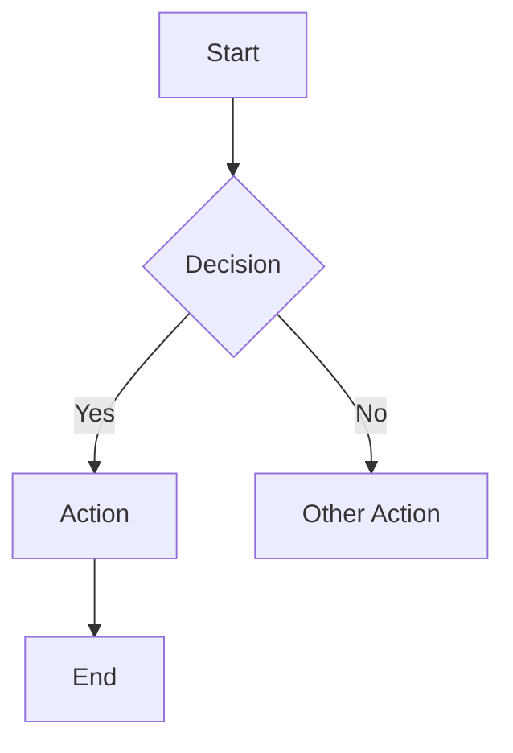
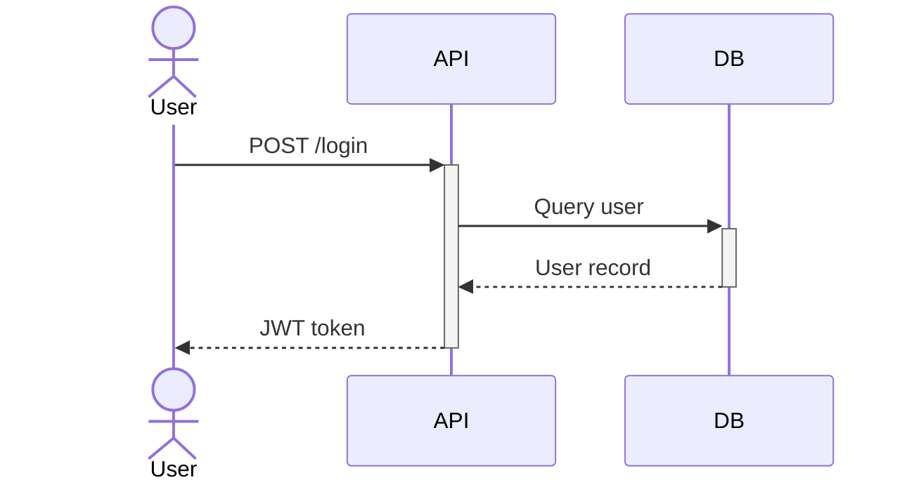

# Design Studio — Skills Catalog

Full instructions for all 30 sub-skills. Read the relevant section before executing any design task.

---

## Table of Contents

**Creative Agency**
- [creative-agency](#creative-agency) — Proactive creative direction for open-ended / vague design prompts; constraint & reference hierarchy when material is provided

**UI/UX Design**
- [ui-ux-designer](#ui-ux-designer) — Design systems, tokens, user research, cross-platform UX
- [ui-ux-pro-max](#ui-ux-pro-max) — 50 styles, 21 palettes, scripted design system generator
- [frontend-design](#frontend-design) — ASCII wireframes → themed implementation
- [ui-design](#ui-design) — Visual system design: product UI vs. marketing tracks
- [superdesign-cli](#superdesign-cli) — SuperDesign CLI: canvas drafts, design iteration, repo analysis

**Design Quality & Polish**
- [impeccable](#impeccable) — Production-grade, anti-AI-aesthetic, craft/teach/extract modes
- [design-taste](#design-taste) — Anti-cliché patterns, ban Inter/AI-purple, bento architecture
- [emil-design-eng](#emil-design-eng) — Emil Kowalski's design engineering: compound polish, animation philosophy

**Motion & Animation**
- [ui-animation](#ui-animation) — Springs, easing, gestures, clip-path, drag, motion review

**Visual & Generative Art**
- [canvas-design](#canvas-design) — Poster, banner, PNG/PDF static art
- [algorithmic-art](#algorithmic-art) — p5.js generative / algorithmic art
- [theme-factory](#theme-factory) — Apply pre-set color+font themes to artifacts

**Component Systems & Theming**
- [tailwind-design-system](#tailwind-design-system) — Tokens, component library, dark mode
- [web-artifacts-builder](#web-artifacts-builder) — Multi-component React/HTML artifacts

**Data Visualization & Diagrams**
- [kpi-dashboard-design](#kpi-dashboard-design) — Business KPI dashboards
- [d3-viz](#d3-viz) — D3.js custom interactive charts
- [mermaid-expert](#mermaid-expert) — Flowcharts, ERDs, sequence diagrams

**Mobile Design**
- [mobile-design](#mobile-design) — iOS/Android, React Native, Flutter
- [building-native-ui](#building-native-ui) — Expo Router, native styling, navigation, animations
- [sleek-design-mobile](#sleek-design-mobile) — Sleek AI mobile screen generation via REST API

**Accessibility & Compliance**
- [accessibility-audit](#accessibility-audit) — Automated WCAG audit with axe-core
- [wcag-audit](#wcag-audit) — WCAG 2.2 patterns and remediation
- [screen-reader-testing](#screen-reader-testing) — VoiceOver, NVDA, JAWS testing

**Audit & Review**
- [audit-website](#audit-website) — 230+ rule full-site audit: SEO, perf, security, accessibility
- [ui-audit](#ui-audit) — Final-pass UI quality review
- [typography-audit](#typography-audit) — 89-rule typography audit
- [web-design-guidelines](#web-design-guidelines) — UI code review

**Extraction & Analysis**
- [extract-design-system](#extract-design-system) — Reverse-engineer design tokens from any live URL

**Portfolio & Showcase**
- [interactive-portfolio](#interactive-portfolio) — Personal website / portfolio builds

---

---

## ui-ux-designer

**When to use:** Full design system creation, design tokens, component library architecture, user research planning, cross-platform UX strategy, accessibility-first design, design handoff.

### Role
Expert UI/UX designer specializing in design systems, accessibility-first design, and modern design workflows. Covers the full spectrum from research to implementation handoff.

### Core Capabilities
- Atomic design methodology with token-based architecture (Brand → Semantic → Component tokens)
- Design token creation and management (Figma Variables, Style Dictionary)
- Component library design with documentation
- Multi-brand design system architecture
- User research: interviews, usability testing, A/B test design, journey mapping
- WCAG 2.1/2.2 AA and AAA compliance, accessible color palette creation
- Figma advanced workflows (Auto Layout, Variants, Variables, plugin dev)
- Design-to-dev handoff (Storybook, Chromatic, Zeroheight)
- Responsive web + native mobile (iOS HIG, Material Design 3)
- Data visualization and dashboard design
- Design system versioning, governance, and adoption tracking

### Workflow
1. **Research user needs** — validate assumptions with data before designing
2. **Design systematically** — tokens and reusable components over one-off designs
3. **Prioritize accessibility** — WCAG compliance from concept stage, not retrofit
4. **Document decisions** — clear rationale and usage guidelines for every component
5. **Collaborate with dev** — optimal handoff with specs, tokens, and interaction notes
6. **Test and iterate** — user feedback, analytics, design impact measurement

### Output
- Design system documentation (tokens, components, patterns, guidelines)
- User research plans and synthesis reports
- Annotated wireframes and interaction specs
- Accessibility audit reports with remediation plans
- Design token files (JSON/CSS custom properties)

---

## ui-ux-pro-max

**When to use:** Building or designing UI with specific style (glassmorphism, brutalism, neumorphism, bento, dark mode, minimalism, claymorphism, skeuomorphism, flat), or when you need a complete design system recommendation with colors + typography + patterns for a specific product type across any stack.

### Overview
Comprehensive design intelligence with 50+ styles, 21 color palettes, 57 font pairings, 99 UX guidelines, and 25 chart types across 9 technology stacks. Uses a scripted search tool to generate design system recommendations.

### Supported Stacks
`html-tailwind` (default), `react`, `nextjs`, `vue`, `svelte`, `swiftui`, `react-native`, `flutter`, `shadcn`

### Workflow

**Step 1 — Analyze requirements**
Extract: product type (SaaS/e-commerce/portfolio/dashboard), style keywords (minimal/playful/professional/dark), industry (healthcare/fintech/gaming), stack.

**Step 2 — Generate design system (ALWAYS first)**
```bash
python3 .claude/skills/ui-ux-pro-max/scripts/search.py "<product_type> <industry> <keywords>" --design-system -p "Project Name"
```
Returns: pattern, style, colors, typography, effects, anti-patterns.

**Step 3 — Targeted domain searches (as needed)**
```bash
python3 .claude/skills/ui-ux-pro-max/scripts/search.py "<keyword>" --domain <domain>
```
Domains: `product`, `style`, `typography`, `color`, `landing`, `chart`, `ux`, `web`

**Step 4 — Stack guidelines**
```bash
python3 .claude/skills/ui-ux-pro-max/scripts/search.py "<keyword>" --stack html-tailwind
```

### Rule Priority
1. Accessibility (CRITICAL) — 4.5:1 contrast, focus states, aria labels, keyboard nav
2. Touch & Interaction (CRITICAL) — 44×44px targets, loading states, error feedback
3. Performance (HIGH) — WebP, lazy loading, prefers-reduced-motion
4. Layout & Responsive (HIGH) — viewport meta, 16px min body, no horizontal scroll
5. Typography & Color (MEDIUM) — 1.5–1.75 line-height, 65–75 char line length
6. Animation (MEDIUM) — 150–300ms micro-interactions, transform/opacity only
7. Style Selection (MEDIUM) — match style to product type, no emoji icons
8. Charts & Data (LOW) — match chart type to data, accessible colors

### Pre-Delivery Checklist
- [ ] No emojis as icons (use SVG: Heroicons, Lucide)
- [ ] All clickable elements have `cursor-pointer`
- [ ] Light mode text contrast ≥ 4.5:1 (use `#0F172A` not `#94A3B8` for body)
- [ ] Glass/transparent elements visible in light mode (`bg-white/80` min)
- [ ] Floating elements have edge spacing (`top-4 left-4 right-4` for navbars)
- [ ] Responsive at 375px, 768px, 1024px, 1440px
- [ ] `prefers-reduced-motion` respected

---

## frontend-design

**When to use:** Building a landing page, dashboard, or UI component quickly — ASCII wireframe planning + themed Tailwind/HTML implementation.

### Workflow
1. **Layout** — Sketch in ASCII before writing a single line of code
2. **Theme** — Define color system, fonts, spacing, shadows using CSS custom properties
3. **Animation** — Plan micro-interactions with timing notation
4. **Implement** — Generate clean, semantic, accessible HTML+Tailwind

### ASCII Wireframe Format
```
┌─────────────────────────────────────┐
│         HEADER / NAV BAR            │
├─────────────────────────────────────┤
│            HERO SECTION             │
│         (Title + CTA)               │
├─────────────────────────────────────┤
│   FEATURE   │  FEATURE  │  FEATURE  │
│     CARD    │   CARD    │   CARD    │
├─────────────────────────────────────┤
│            FOOTER                   │
└─────────────────────────────────────┘
```

### Theme Patterns

**Modern Dark (Vercel/Linear):**
```css
:root {
  --background: oklch(1 0 0);
  --foreground: oklch(0.145 0 0);
  --primary: oklch(0.205 0 0);
  --border: oklch(0.922 0 0);
  --font-sans: Inter, system-ui, sans-serif;
}
```

**Neo-Brutalism:**
```css
:root {
  --background: oklch(1 0 0);
  --foreground: oklch(0 0 0);
  --primary: oklch(0.649 0.237 26.97);
  --border: oklch(0 0 0);
  --radius: 0px;
  --shadow: 4px 4px 0px 0px hsl(0 0% 0%);
  --font-sans: DM Sans, sans-serif;
}
```

**Glassmorphism:**
```css
.glass {
  background: rgba(255,255,255,0.1);
  backdrop-filter: blur(10px);
  border: 1px solid rgba(255,255,255,0.2);
  border-radius: 1rem;
}
```

### Animation Micro-Syntax
```
button:  150ms [S1→0.95→1] press
hover:   200ms [Y0→-2, shadow↗]
fadeIn:  400ms ease-out [Y+20→0, α0→1]
```
- Entry: 300–500ms ease-out
- Hover: 150–200ms
- Button press: 100–150ms

### CDN Imports
```html
<script src="https://cdn.tailwindcss.com"></script>
<script src="https://unpkg.com/lucide@latest/dist/umd/lucide.min.js"></script>
```
Images: Use `https://images.unsplash.com/photo-xxx?w=800&h=600` — never fake URLs.

### Quick Reference
| Element | Recommendation |
|---------|---------------|
| Primary font | Inter, Outfit, DM Sans |
| Code font | JetBrains Mono, Fira Code |
| Border radius | 0.5–1rem (modern), 0 (brutalist) |
| Shadow | Subtle, 1–2 layers max |
| Animation | 150–400ms, ease-out |
| Colors | oklch() preferred, avoid generic blue (#007bff) |

---

## canvas-design

**When to use:** Creating static visual art — posters, banners, art prints, flyers, promotional graphics — output as PNG or PDF.

### Role
Visual designer with strong design philosophy. Creates original, intentional graphics — not generic stock-art-style outputs. Never copies existing artists' work.

### Process
1. **Develop a design philosophy** — define the visual concept, mood, and intention before executing
2. **Choose composition approach** — rule of thirds, golden ratio, visual hierarchy
3. **Select color palette** — intentional, harmonious, serves the concept
4. **Select typography** — typefaces that reinforce the mood
5. **Execute** — produce the artifact (PNG/PDF)

### Design Principles
- Every element should be purposeful — remove anything that doesn't earn its place
- Contrast drives attention — use it to guide the eye
- Whitespace is a design element, not empty space
- Typography is design — letter-spacing, weight, and size are as important as color
- Colors should evoke emotion appropriate to the purpose

### Output
- PNG for digital display and social media
- PDF for print production

---

## algorithmic-art

**When to use:** Generative / algorithmic art — p5.js flow fields, particle systems, noise fields, emergent visual systems, code-as-art.

### Two-Phase Process

**Phase 1 — Algorithmic Philosophy (.md file)**
Create a named movement ("Organic Turbulence", "Quantum Harmonics") with a manifesto articulating:
- Computational processes and mathematical relationships
- Noise functions and randomness patterns
- Particle behaviors and field dynamics
- Temporal evolution and system states
- Parametric variation and emergent complexity

The philosophy must emphasize craft — the algorithm should appear as if it took countless hours to develop and refine. This framing guides the quality of implementation.

**Phase 2 — p5.js Implementation (.html + .js files)**
Express the philosophy in code:
- Use seeded randomness for reproducibility
- Layered Perlin noise for organic variation
- Particle systems following vector force fields
- Color derived from velocity, density, or system state
- Interactive parameter exploration (sliders, mouse input)
- 90% algorithmic generation, 10% essential control parameters

### Key Techniques
```javascript
// Seeded randomness
let seed = 42;
function seededRandom() { ... }

// Perlin noise flow field
let angle = noise(x * scale, y * scale) * TWO_PI * 2;

// Particle trail accumulation
particle.update();
particle.draw(); // trails create density maps over time
```

### Output
- `philosophy.md` — the manifesto
- `sketch.html` — interactive viewer
- `algorithm.js` — the generative algorithm

---

## theme-factory

**When to use:** Applying a cohesive color + font theme to slides, docs, HTML artifacts, reports, or any presentation artifact.

### Available Themes (10 pre-set)
1. **Ocean Depths** — Professional, calming maritime
2. **Sunset Boulevard** — Warm, vibrant sunset
3. **Forest Canopy** — Natural earth tones
4. **Modern Minimalist** — Clean grayscale
5. **Golden Hour** — Rich autumnal palette
6. **Arctic Frost** — Cool winter-inspired
7. **Desert Rose** — Dusty, sophisticated
8. **Tech Innovation** — Bold modern tech
9. **Botanical Garden** — Fresh, organic
10. **Midnight Galaxy** — Dramatic, cosmic

### Process
1. Show `theme-showcase.pdf` (do not modify — display only)
2. Ask user which theme to apply
3. Wait for selection
4. Read the theme spec from `themes/` directory
5. Apply colors and fonts consistently to the artifact

### Custom Themes
If none fit, generate a new theme: take the user's description → name it appropriately → define hex palette + font pairings → show for approval → apply.

---

## tailwind-design-system

**When to use:** Creating a design token architecture, building a Tailwind component library, implementing dark mode, standardizing UI patterns across a codebase.

### Token Hierarchy
```
Brand Tokens (abstract)      blue-500
    └── Semantic Tokens       primary
        └── Component Tokens  button-bg
```

### Tailwind Config Structure
```typescript
// tailwind.config.ts
const config: Config = {
  darkMode: 'class',
  theme: {
    extend: {
      colors: {
        primary: {
          DEFAULT: 'hsl(var(--primary))',
          foreground: 'hsl(var(--primary-foreground))',
        },
      },
    },
  },
}
```

### Component Architecture
```
Base styles → Variants → Sizes → States → Overrides
```

### Dark Mode Pattern
```css
:root { --primary: 222 47% 11%; }
.dark { --primary: 210 40% 98%; }
```

### Key Patterns
- Use CSS custom properties for all color values (enables theming)
- `cva()` (class-variance-authority) for variant management
- Separate layout tokens (spacing, sizing) from visual tokens (color, shadow)
- Document every component with usage examples and anti-patterns

---

## web-artifacts-builder

**When to use:** Creating elaborate multi-component web artifacts with React state management, routing, or shadcn/ui components. Not for simple single-file HTML.

### When to Use vs. Simple HTML
- Use this for: dashboards with filters, multi-step flows, tabbed interfaces, data tables with sorting/pagination, anything with meaningful interactivity
- Use plain HTML for: static content, simple layouts, single-purpose displays

### Stack
- React (hooks: useState, useReducer, useContext, useMemo, useCallback)
- Tailwind CSS (utility classes only — no custom CSS unless necessary)
- shadcn/ui components (Alert, Button, Card, Dialog, Form, Table, etc.)
- lucide-react for icons
- recharts for charts

### Structure Pattern
```jsx
// Single file, default export, no required props
export default function Dashboard() {
  const [activeTab, setActiveTab] = useState('overview');
  return (
    <div className="min-h-screen bg-background">
      {/* ... */}
    </div>
  );
}
```

### Rules
- No localStorage or sessionStorage (not supported in artifact environment)
- All state in React (useState/useReducer)
- Default export with no required props
- Import lucide-react@0.383.0, recharts from their packages
- Tailwind core utilities only (no compiler, no custom config)

---

## kpi-dashboard-design

**When to use:** Designing or building business dashboards — selecting the right KPIs, structuring the layout, choosing chart types for different data patterns.

### KPI Framework
| Level | Focus | Frequency | Audience |
|-------|-------|-----------|----------|
| Strategic | Long-term goals | Monthly/Quarterly | Executives |
| Tactical | Department goals | Weekly/Monthly | Managers |
| Operational | Day-to-day | Real-time/Daily | Teams |

### Dashboard Hierarchy
```
Executive Summary (4–6 KPIs + trend indicators)
  ├── Sales Dashboard (MRR, pipeline, win rate)
  ├── Marketing Dashboard (CAC, CVR, attribution)
  ├── Ops Dashboard (throughput, cycle time)
  └── Finance Dashboard (burn rate, runway, margins)
      └── Drilldowns (root cause analysis)
```

### Chart Selection Guide
| Data Pattern | Chart Type |
|-------------|-----------|
| Trend over time | Line chart |
| Part-to-whole | Pie / donut (≤5 segments) |
| Comparison | Bar chart |
| Distribution | Histogram |
| Correlation | Scatter plot |
| Progress to goal | Gauge / progress bar |
| Funnel stages | Funnel chart |

### Layout Principles
- Hero KPIs at top with trend indicators (▲/▼ + %)
- Most important metric top-left (reading pattern)
- Group related metrics spatially
- Use color consistently: green = positive, red = negative, gray = neutral
- Provide context: show target, historical average, or benchmark
- Avoid 3D charts, dual y-axes, and pie charts with > 5 slices

---

## d3-viz

**When to use:** Custom interactive data visualization requiring fine-grained control — network diagrams, geographic maps, bespoke charts, complex SVG animations, any visualization beyond standard charting libraries.

### When D3 vs. Recharts
- Use **recharts** for: standard bar/line/pie charts in React
- Use **D3** for: custom layouts, force simulations, geographic projections, radial charts, anything non-standard

### Core D3 Pattern
```javascript
// Data join pattern (D3 v7)
const bars = svg.selectAll('rect')
  .data(data)
  .join('rect')
    .attr('x', d => xScale(d.label))
    .attr('y', d => yScale(d.value))
    .attr('width', xScale.bandwidth())
    .attr('height', d => height - yScale(d.value));
```

### Scale Selection
| Data Type | Scale |
|-----------|-------|
| Continuous numeric | `scaleLinear` |
| Categorical | `scaleBand` |
| Log distribution | `scaleLog` |
| Color mapping | `scaleOrdinal`, `scaleSequential` |
| Time | `scaleTime` |

### Transitions
```javascript
bars.transition()
  .duration(500)
  .ease(d3.easeCubicOut)
  .attr('height', d => height - yScale(d.value));
```

### React Integration
```jsx
useEffect(() => {
  const svg = d3.select(svgRef.current);
  // D3 manipulates DOM directly within useEffect
  // Clean up: return () => { svg.selectAll('*').remove(); }
}, [data]);
```

---

## mermaid-expert

**When to use:** Creating diagrams — flowcharts, sequence diagrams, entity-relationship diagrams, class diagrams, Gantt charts, architecture diagrams, state machines.

### Diagram Type Selection
| Need | Diagram |
|------|---------|
| Process flow, decision tree | `flowchart` |
| API/service interactions, timing | `sequenceDiagram` |
| Database schema, data model | `erDiagram` |
| OOP class structure | `classDiagram` |
| Project timeline | `gantt` |
| State machine | `stateDiagram-v2` |
| Git branch history | `gitGraph` |
| Hierarchical breakdown | `mindmap` |

### Syntax Patterns

**Flowchart:**


**Sequence:**


**ERD:**
```mermaid
erDiagram
    USER ||--o{ ORDER : places
    ORDER ||--|{ ITEM : contains
    USER { string id PK; string email }
    ORDER { string id PK; date created_at }
```

### Styling
```mermaid
%%{init: {"theme": "dark", "themeVariables": {"primaryColor": "#6366f1"}}}%%
```

---

## mobile-design

**When to use:** Mobile-first design thinking for iOS/Android apps, React Native, or Flutter. Touch interaction, platform conventions, performance patterns.

### Core Philosophy
> Touch-first. Battery-conscious. Platform-respectful. Offline-capable.
> Mobile is NOT a small desktop.

### ALWAYS Ask Before Assuming
- Platform target? (iOS / Android / both)
- Framework? (React Native / Flutter / native)
- Offline support required?
- Performance constraints?

### Touch Interaction Principles
- Minimum touch target: **44×44px** (iOS HIG) / **48×48dp** (Material)
- Thumb zone: bottom 2/3 of screen is comfortable reach
- Swipe vs tap: use tap for primary actions, swipe for secondary
- Haptics: light for selections, medium for confirmations, heavy for errors
- No hover-dependent interactions (hover doesn't exist on touch)

### Platform Conventions
**iOS:** Back gesture (swipe right), bottom tab bar, SF Pro font, system colors
**Android:** Bottom navigation or nav drawer, Roboto/Google Sans, Material You dynamic color

### Performance Rules
- 60fps minimum (16ms frame budget)
- Lists: FlatList with `getItemLayout` and `keyExtractor`; virtualization always on
- Images: cache aggressively, use `resizeMode`, never load full-resolution unnecessarily
- JS thread vs UI thread — heavy ops belong on background threads
- Bundle splitting for large apps

### Reference Files (read before implementing)
For deep implementation detail, reference files in the `mobile-design` skill:
- `mobile-design-thinking.md` — forces intentional thinking over defaults
- `touch-psychology.md` — Fitts' Law, gestures, haptics
- `platform-ios.md` / `platform-android.md` — platform-specific patterns
- `mobile-performance.md` — 60fps, memory management

---

## accessibility-audit

**When to use:** Comprehensive automated + manual WCAG accessibility audit using axe-core, with structured remediation guidance.

### Audit Approach
1. **Automated scan** — axe-core catches ~30–40% of issues
2. **Manual keyboard testing** — Tab through every interactive element
3. **Screen reader testing** — VoiceOver (Mac/iOS) or NVDA (Windows)
4. **Color contrast analysis** — Every text/background combination
5. **Remediation report** — Prioritized by impact (critical → serious → moderate → minor)

### axe-core Setup
```javascript
const { AxePuppeteer } = require('@axe-core/puppeteer');
const results = await new AxePuppeteer(page)
  .withTags(['wcag2a', 'wcag2aa', 'wcag21aa'])
  .analyze();
```

### Common Violations by Impact
**Critical (blockers):**
- Missing alt text on functional images
- No keyboard access to interactive elements
- Missing form labels
- Auto-playing media without controls

**Serious:**
- Insufficient color contrast (< 4.5:1 for text)
- Missing skip links
- Inaccessible custom widgets (dropdowns, modals without ARIA)

**Moderate:**
- Missing page language attribute
- Unclear link text ("click here", "read more")
- Missing fieldset/legend for form groups

### Remediation Priority
Fix in this order: Critical → Serious → Moderate → Minor. Focus on Criticals first — they are full blockers for assistive technology users.

---

## wcag-audit

**When to use:** Fixing specific WCAG 2.2 violations, implementing accessible component patterns, meeting ADA/Section 508/VPAT requirements.

### Conformance Levels
| Level | Description | Required For |
|-------|-------------|-------------|
| A | Minimum | Legal baseline |
| AA | Standard | Most regulations (ADA, Section 508) |
| AAA | Enhanced | Specialized needs |

### POUR Principles
```
Perceivable  — Can users perceive the content?
Operable     — Can users operate the interface?
Understandable — Can users understand it?
Robust       — Does it work with assistive tech?
```

### Key Patterns

**Accessible button:**
```html
<button type="button" aria-label="Close dialog">
  <svg aria-hidden="true">...</svg>
</button>
```

**Skip link:**
```html
<a href="#main-content" class="sr-only focus:not-sr-only">
  Skip to main content
</a>
```

**Accessible form:**
```html
<label for="email">Email address</label>
<input id="email" type="email" aria-describedby="email-hint" required>
<span id="email-hint">We'll never share your email</span>
```

**Focus trap (modal):**
```javascript
// Trap focus within modal, restore on close
// First/last focusable elements, Escape key to close
```

**Color contrast requirements:**
- Normal text: 4.5:1 minimum (AA)
- Large text (18pt+ or 14pt bold): 3:1 minimum
- UI components and graphics: 3:1 minimum

---

## screen-reader-testing

**When to use:** Validating screen reader compatibility, debugging ARIA issues, ensuring assistive technology support.

### Screen Readers to Test
| SR | Platform | Browser |
|----|----------|---------|
| VoiceOver | macOS / iOS | Safari |
| NVDA | Windows | Firefox / Chrome |
| JAWS | Windows | Chrome / Edge |
| TalkBack | Android | Chrome |

### VoiceOver Quick Keys (macOS)
- `VO + Right/Left` — move to next/previous element
- `VO + Space` — activate element
- `VO + F8` — open VO Utility
- `Ctrl` — stop speaking

### Key Test Scenarios
1. **Page load** — is the page title read? Is focus set correctly?
2. **Navigation** — can the user reach every interactive element via Tab?
3. **Forms** — are labels associated? Are errors announced?
4. **Images** — are meaningful images described? Are decorative ones silent?
5. **Dynamic content** — are live regions (`aria-live`) announcing updates?
6. **Modals** — does focus move in? Is focus trapped? Does it return on close?

### Common ARIA Patterns
```html
<!-- Live region for dynamic updates -->
<div aria-live="polite" aria-atomic="true">Status: Loading...</div>

<!-- Alert (interrupts) -->
<div role="alert">Error: Required field missing</div>

<!-- Landmark regions -->
<header role="banner">
<nav aria-label="Main navigation">
<main id="main-content">
<footer role="contentinfo">
```

---

## web-design-guidelines

**When to use:** Reviewing existing UI code for design quality, UX best practices, and accessibility compliance. Audit before shipping.

### Review Checklist

**Visual Quality**
- [ ] No emojis used as UI icons (use SVG: Heroicons, Lucide, Phosphor)
- [ ] Consistent icon set and sizing throughout
- [ ] Hover states don't cause layout shift
- [ ] Shadows are subtle (1–2 layers, not heavy drop shadows)
- [ ] Color palette is intentional (no generic Bootstrap blue)

**Interaction**
- [ ] All clickable/interactive elements have `cursor-pointer`
- [ ] Hover states give clear visual feedback
- [ ] Transitions smooth: 150–300ms
- [ ] Focus states visible for keyboard navigation
- [ ] Loading and disabled states handled

**Accessibility**
- [ ] All images have alt text (or `alt=""` if decorative)
- [ ] Form inputs have associated labels
- [ ] Color is not the only means of conveying information
- [ ] `prefers-reduced-motion` media query respected
- [ ] Heading hierarchy is logical (h1 → h2 → h3, no skips)
- [ ] Semantic HTML used (not just `<div>` everywhere)

**Layout & Responsive**
- [ ] Mobile tested at 375px — no horizontal scroll
- [ ] Fixed navbars account for their height in content padding
- [ ] Consistent container max-width across pages
- [ ] Images use WebP with fallback, lazy loaded

**Light/Dark Mode**
- [ ] Text contrast in light mode ≥ 4.5:1
- [ ] Transparent/glass elements visible in both modes
- [ ] Borders visible in both modes

### Severity Levels
- **Critical** — Breaks usability or accessibility for a class of users
- **Serious** — Significantly degrades experience
- **Moderate** — Noticeable quality issue
- **Minor** — Preference / polish

---

## interactive-portfolio

**When to use:** Building a personal website, developer/designer portfolio, or work showcase that converts visitors into opportunities.

### The 30-Second Rule
In 30 seconds, visitors must know: who you are, what you do, your best work, and how to contact you. Design with this constraint in mind.

### Essential Sections
| Section | Purpose | Priority |
|---------|---------|----------|
| Hero | Hook + identity + clear value prop | Critical |
| Work/Projects | Prove skills with 3–5 best pieces | Critical |
| About | Personality + story + credibility | Important |
| Contact | Low-friction conversion (form or email) | Critical |
| Testimonials | Social proof | Nice to have |
| Blog/Writing | Thought leadership | Optional |

### Project Case Study Structure
```
Problem → Your Role → Process → Solution → Results
```
Results with numbers beat descriptions: "increased conversion 23%" > "improved performance".

### Navigation Patterns
- **Single-page scroll** — Best for designers/creatives, animation-friendly, mobile-first
- **Multi-page** — Better for large portfolios with many distinct sections
- **Hybrid** — Single page with anchor links + separate case study pages

### Design Principles for Portfolios
- The portfolio itself IS the portfolio — it must demonstrate your design ability
- Less is more: 5 great projects beat 20 mediocre ones
- Make it fast — portfolio visitors are impatient; use skeleton screens, WebP, lazy load
- Mobile-first — many recruiters/clients browse on phone
- One clear CTA — "Email me", "Book a call", or "Download resume"

### Technical Implementation
- Use `prefers-color-scheme` for automatic dark/light mode
- Animate on scroll sparingly (IntersectionObserver, `animation-play-state`)
- `og:image` and proper meta tags for social sharing
- Host on Vercel, Netlify, or GitHub Pages (all free)

---

---

## creative-agency

**When to use:** Any time the design prompt is intentionally vague, open-ended, or explicitly inviting creative autonomy. Triggers: "design something award-winning", "make it go viral", "surprise me", "go wild", "make it beautiful", "I trust you", "do what feels right", "no constraints", or any prompt where the user is deliberately NOT specifying the aesthetic.

### Philosophy
This mode exists because the best design decisions often can't be spec'd in advance. When you're given creative latitude, the job isn't to ask clarifying questions — it's to develop a strong point of view and execute it with conviction. A great designer handed a blank brief doesn't say "what color should the button be?" They make a choice and defend it.

### Activation Protocol

**Step 1 — Develop a creative brief (internally)**
Before touching a single pixel or line of code, think through:
- What is this for, and who is it for? (infer from context)
- What emotional response should it create?
- What would make this genuinely memorable vs. forgettable?
- What's a visual direction nobody else would think to try here?
- What reference points exist (movements, eras, aesthetics, art forms) that could inform this?

**Step 2 — Make a bold POV decision**
Pick a direction. Not a safe one — a specific, defensible one. Then commit. Think:
- What one aesthetic movement or visual language will anchor this?
- What's the typographic personality? (not "modern sans-serif" — *which one, why, and how used*)
- What does the color system feel like emotionally?
- What motion language fits the energy of this thing?

**Step 3 — State your creative direction briefly**
In 2–4 sentences, tell the user what direction you chose and why. Not asking permission — declaring intent. Example: *"I'm going with a late-70s Swiss modernism feel — Neue Haas Grotesk, restrained grid, a single warm amber accent against near-black. The idea is that it feels expensive and authoritative the way Braun electronics do — you trust it before you read a word."*

**Step 4 — Execute with full conviction**
Build it. Don't hedge. Don't leave placeholder lorem ipsum. Don't make "version A (safe) and version B (interesting)". Make the interesting one.

**Step 5 — Reflect and invite iteration**
After delivering, offer: *"This is the direction I committed to — happy to pivot the aesthetic entirely if this isn't the feeling you're after, or push it further in any direction."*

### Creative Sources to Draw From
When developing a POV, consider pulling from:
- **Design movements**: Swiss Modernism, Bauhaus, Memphis, De Stijl, Art Nouveau, Brutalism, Constructivism, Y2K, Vaporwave, Quiet Luxury
- **Adjacent disciplines**: Architecture, fashion, editorial, film poster design, album art, game UI, industrial design
- **Emotional registers**: Intimidating, playful, intimate, clinical, anarchic, serene, kinetic
- **Unexpected constraints**: "What if this had no rounded corners?", "What if the only color was one saturated hue on white?", "What if the type was the image?"

### What NOT to Do in This Mode
- Don't produce a generic SaaS landing page with hero + features + CTA
- Don't use Inter/DM Sans unless it's a deliberate choice you can articulate
- Don't ask "what style do you prefer?" — infer and decide
- Don't hedge with multiple safe options instead of one bold one
- Don't produce something you couldn't describe in a memorable sentence

---

### Constraint & Reference Hierarchy

When the user provides *any* constraints or reference material alongside an open-ended prompt, creative freedom is no longer the top priority. The hierarchy is absolute:

**Tier 1 — Explicit Constraints (non-negotiable)**
Named colors, required copy, mandated layouts, brand rules, technology restrictions. These are honored exactly and never overridden by a creative instinct — no matter how compelling.

Examples: *"use our brand blue #2B4FFF"*, *"this has to work in the existing Tailwind config"*, *"the hero copy is locked: 'Ship faster'"*

**Tier 2 — Reference Material (strong signal)**
Screenshots, URLs, mood boards, named styles, or example interfaces. These are analyzed first, mined for specific signals, then interpreted — not just vibes-matched.

When reference material is provided, run this analysis protocol before touching a single decision:
1. Extract **specific** details — not "clean and minimal" but "3:1 negative space ratio, monospaced labels, accent color appears once per viewport"
2. Identify what is **structural** (grid logic, hierarchy, spacing rhythm) vs. what is **surface** (colors, fonts, textures)
3. Determine what type of reference this is (see Reference Modes below) — then apply accordingly
4. Only after completing this extraction: proceed to creative brief

**Tier 3 — Creative Freedom (fills the vacuum)**
Applies only to dimensions not addressed by Tiers 1 and 2. If the reference specifies layout but not color, creative freedom governs color. If constraints name a font but not spacing, creative freedom governs spacing.

---

### Reference Modes

**Mode A — "Match this vibe"**
The user wants the emotional and aesthetic DNA of the reference replicated. Goal is resonance, not copying.

Protocol:
- Extract: mood, energy level, spatial rhythm, typographic personality, color temperature
- Identify the *design decisions* that produce that feeling (not just surface elements)
- Recreate the feeling with original execution — never copy layout or content verbatim
- Declare: *"I'm pulling the [X] quality from this reference — the [specific observation] — and applying it through [different specific execution]."*

**Mode B — "Quality bar benchmark"**
The reference sets a standard of craft, not a direction. The user is saying "be this good", not "look like this."

Protocol:
- Analyze what makes it excellent: micro-interactions, spacing precision, typographic hierarchy, state handling, empty states
- Extract the craft principles, not the aesthetic
- Apply those principles to an original visual direction
- Do not let the reference constrain the aesthetic direction at all — only the quality floor

**Mode C — "Take inspiration from X but make it mine"**
Selective borrowing. The user wants a specific element — a layout pattern, a color approach, a motion style — adapted, not adopted.

Protocol:
- Clarify (once, briefly) which element resonates: *"Are you drawn to the navigation structure, the color system, or the overall spatial feel?"* — unless it's obvious from context
- Extract only that element with surgical precision
- Everything else proceeds via free creative direction
- The borrowed element should feel native to the new context, not transplanted

---

### When Reference and Creative Freedom Conflict

If a reference implies something that would conflict with creative excellence — e.g., a reference has a dated layout pattern, generic typeface, or muddy color palette — the right move is:
1. Honor the specific thing the user pointed to
2. Elevate everything around it
3. State this explicitly: *"I've kept the [X] you referenced and elevated the surrounding system."*

Never silently ignore reference material. Never silently override explicit constraints.

---

### Self-Improvement Loop
After each creative-agency execution, log what worked and what felt generic in a brief internal note. Over time, build a mental repository of the aesthetic decisions that produced the strongest results in this user's context.

---

## impeccable

**When to use:** When you want production-grade, distinctive frontend design that avoids the "AI slop" aesthetic — recognizable AI defaults like Inter everywhere, gradient text, side-stripe alert borders. Use craft mode to build, teach mode to set up design context, extract mode for reusable components.

### Core Principle
> "A distinctive interface should make someone ask 'how was this made?' not 'which AI made this?'"

### Three Modes

**`craft`** — Shape-then-build. Confirm design context first, then implement.
**`teach`** — Explore the codebase, ask focused UX questions, write `.impeccable.md` Design Context file.
**`extract`** — Pull reusable components from existing UI.

### Context Protocol (ALWAYS first)
Before any design work:
1. Check current instructions for existing Design Context
2. Read `.impeccable.md` from project root if it exists
3. If neither exists: run teach mode — explore codebase, ask focused UX questions, write context

### Absolute Bans (most recognizable AI tells)
- **Side-stripe borders** — `border-l-4` or `border-r-4` on cards/alerts. Completely forbidden.
- **Gradient text fills** — `background-clip: text` rainbow gradients. Forbidden.
- **Reflex fonts** — Inter, DM Sans, Fraunces used reflexively without rationale. Pick fonts with intentionality.

### Typography
Font selection is a 4-step process anchored in brand voice, not designer reflex:
1. What is the brand's personality? (clinical, playful, authoritative, warm...)
2. What typographic tradition matches that? (humanist sans, geometric, transitional serif...)
3. Which specific typefaces embody it with distinctive character?
4. Validate against the "reflex fonts" list — if it's on there, find a better reason to use it or pick another

### Color
- OKLCH color space for perceptual uniformity
- Tint neutrals toward brand hue (never pure gray)
- 60-30-10 rule for visual weight
- Theme (light/dark) must derive from actual user context, not defaults

### Layout
- 4pt spacing scale with semantic tokens
- `gap` for sibling spacing (not margins)
- Vary spacing rhythmically — embrace intentional asymmetry
- Grid breaks are intentional design moves, not accidents

### Seven Reference Domains
When deeper guidance is needed, the full skill has reference files for: typography, color/contrast, spatial design, motion design, interaction design, responsive design, and UX writing.

---

## design-taste

**When to use:** Enforcing premium anti-cliché UI patterns. Counteracting common AI-generated design signatures. Building SaaS dashboards, marketing sites, or any interface that should feel like it cost money to design.

### Core Metrics (tunable)
- **Design Variance**: 8/10 — push for distinctiveness
- **Motion Intensity**: 6/10 — present but purposeful
- **Visual Density**: 4/10 — breathable, not sparse

### Hard Bans
| Element | Banned | Use Instead |
|---------|--------|-------------|
| Font | Inter | Geist, Outfit, Cabinet Grotesk, Satoshi |
| Color | AI Purple/Blue aesthetic | Intentional brand palette |
| Black | #000000 (pure) | Near-blacks: #0A0A0A, #0F0F0F |
| Effects | Neon glows, custom mouse cursors | Subtle shadows, intentional depth |
| Content | "John Doe", "99.99% uptime" | Real-feeling specificity |
| Icons | Emojis as UI elements | Lucide, Heroicons, Phosphor |

### The Motion-Engine Bento Architecture
Modern SaaS dashboards that feel "alive":
- White cards (`#ffffff`) on light gray backgrounds (`#f5f5f5`)
- `rounded-[2.5rem]` on outer containers, `rounded-[1.5rem]` on inner cards
- Diffusion shadows: `box-shadow: 0 8px 32px rgba(0,0,0,0.08)`
- Five card archetypes with perpetual micro-interactions:
  - **Intelligent List** — items with subtle entrance staggers
  - **Command Input** — typing indicator, focus ring glow
  - **Live Status** — pulsing indicator, real-time number ticks
  - **Wide Data Stream** — sparkline with animated drawing
  - **Contextual UI** — hover-reveal secondary actions

### Hero Section Rule
**NEVER** use `h-screen`. **ALWAYS** use `min-h-[100dvh]` to prevent layout jumping on mobile browsers.

### Animation Stack
- Framer Motion for complex interactions
- Spring physics: `stiffness: 100, damping: 20`
- Hardware acceleration via `transform` and `opacity` only
- Isolate perpetual micro-animations in their own components

### Pre-Flight Checklist
- [ ] No Inter unless explicitly justified
- [ ] No AI purple/blue palette
- [ ] No pure #000000
- [ ] No `h-screen` hero sections
- [ ] `min-h-[100dvh]` used instead
- [ ] All animations use transform/opacity
- [ ] Empty, loading, and error states all handled
- [ ] Mobile layout tested and non-broken

---

## emil-design-eng

**When to use:** When the goal is to build interfaces that feel *right* — where the details compound into something delightful that users love without consciously understanding why. Particularly strong for animation decisions, interaction design, component behavior, and the philosophy of craft.

### Core Philosophy
*"All those unseen details combine to produce something stunning, like a thousand barely audible voices all singing in tune."*

Design quality isn't one big visible choice — it's hundreds of small invisible ones that accumulate into something people trust and love. The goal is to make decisions so good they're imperceptible.

### Animation Decision Framework
Before animating anything, ask: **Why?**
- Feedback — confirms an action happened
- Orientation — shows where something came from or is going
- Continuity — maintains spatial context during transitions
- Delight — intentional, rare, earns its presence

If none of the above apply, don't animate.

### Duration & Easing
- Button press: 100–150ms, ease-out
- Hover state: 150–200ms
- Dropdown / popover open: 200ms
- Page transition: 300–400ms
- Never use `ease-in` for UI — it feels sluggish. Use `ease-out` or custom cubic-bezier.
- Recommended: `cubic-bezier(0.22, 1, 0.36, 1)` for most interactions

### Component Principles
- **Buttons** — Press feedback (scale 0.97), loading state disables interaction, never just change color
- **Popovers** — Emerge from their trigger point, not from the top of the screen
- **Tooltips** — 300–500ms delay on hover (prevents tooltip flicker on mouse-over)
- **Modals** — Blur background, enter from center (not top), Escape to close
- **Blur masking** — Use to create depth hierarchy; foreground elements sharper than background

### CSS Techniques
```css
/* Hardware-accelerated animation */
.animating { transform: translateY(0); will-change: transform; }

/* Clip-path reveal */
.reveal { clip-path: inset(0 100% 0 0); transition: clip-path 400ms ease-out; }
.reveal.active { clip-path: inset(0 0% 0 0); }

/* 3D depth */
.card { transform-style: preserve-3d; perspective: 1000px; }
```

### Gesture Design
- Momentum: velocity × 0.95 per frame, minimum velocity 0.5px/frame
- Boundary damping: overshoot × 0.3 (rubber-band feel)
- Multi-touch: pinch scale clamped to [0.5, 3.0]

### Performance Rules
- Animate only `transform` and `opacity`
- `will-change` only for elements actively animating — remove after
- CSS transitions beat WAAPI, which beats JS keyframes
- Never use `transition: all`

---

## ui-animation

**When to use:** Designing, implementing, or reviewing motion in any UI — springs, gestures, drag interactions, entrance/exit reveals, easing selection, duration guidelines, clip-path techniques, performance debugging.

### Trigger Phrases
"Add animations to", "make this feel smooth", "review my animations", "add a swipe gesture", "this feels stiff", "animate the transition"

### Core Principles

**Purpose over decoration** — Motion earns its place by providing: feedback, orientation, continuity, or deliberate delight. Keyboard actions should never trigger animation.

**Interruptible and input-driven** — The best animations respond to user input and can be interrupted mid-flight. Predetermined sequences feel robotic.

**Asymmetric timing** — Exit animations must be faster than entry. Entering: 200–300ms. Exiting: 150–200ms. Things that leave should leave quickly.

**Implementation hierarchy**:
`CSS transitions` > `WAAPI` > `CSS keyframes` > `JavaScript animation`

Only animate `transform` and `opacity`. Layout properties and `transition: all` are forbidden.

### Easing Reference
| Use Case | Curve | Duration |
|----------|-------|----------|
| Button feedback, dropdowns | `cubic-bezier(0.22, 1, 0.36, 1)` | 100–250ms |
| Slides, drawers | `cubic-bezier(0.25, 1, 0.5, 1)` | 200–300ms |
| Spring-feel | Framer Motion spring: stiffness 300, damping 30 | — |
| Subtle hover | `ease-out` | 150ms |

Avoid `ease-in` for UI. Reference [easing.dev](https://easing.dev) for custom curves.

### Motion Direction Logic
Elements visible in both states transition **in place** — no teleporting. Rules:
- Overlays emerge from their trigger element
- Tabs slide in the direction matching their position in the tab list
- Modals expand from center or from trigger
- Lists stagger from top to bottom (entry), no stagger needed for exit

### Anti-Patterns
- `transition: all` — animates unexpected properties
- Scaling from zero — use `opacity` + slight `translateY` instead
- Permanent `will-change` — apply only during animation, remove after
- Static cuts between related views
- Hover-only animations without `@media (hover: hover)` gate

### Five-Step Checklist
1. Does this animation serve a purpose? (feedback/orientation/continuity/delight)
2. Choose easing and duration from the reference above
3. Select implementation: CSS transition, WAAPI, or Framer Motion
4. Validate: can it be interrupted? Does it work at reduced motion?
5. Check on real device — desktop perception ≠ mobile perception

---

## audit-website

**When to use:** Comprehensive website health audit covering SEO, technical issues, performance, accessibility, security, and 15+ other categories. Requires the squirrelscan CLI installed from squirrelscan.com/download.

### Coverage
230+ rules across 21 categories: SEO, technical, performance, content quality, security, accessibility, usability, schema markup, legal compliance, local SEO, and more.

### Workflow
1. **Surface scan** — fast structural assessment (100 pages)
2. **Deep scan** — thorough analysis with pattern sampling (500 pages)
3. **Propose fixes** — prioritize by category and impact
4. **Parallelize corrections** — use subagents for bulk edits across files
5. **Re-audit** — verify improvements, confirm scores exceed 95

### Coverage Modes
| Mode | Pages | Use For |
|------|-------|---------|
| Quick | 25 | Fast health checks |
| Surface | 100 | General audits |
| Full | 500 | Comprehensive analysis |

### Key Outputs
- Health scores by category
- Issues list with affected URLs
- Broken link detection
- Actionable recommendations with priority ordering

### Best Practice
Always audit the **live site**, not local — captures true performance, real CDN behavior, actual redirect chains, and live security headers.

### Completion Criteria
Site is fixed when: scores exceed 95 with full coverage, all errors resolved, re-audit confirms improvement.

---

## extract-design-system

**When to use:** Reverse-engineering the design primitives of any publicly accessible website — extracting color palettes, typography, spacing scales, border radius, and shadow patterns into token files that can seed a new project.

### What It Produces
- `.extract-design-system/raw.json` — full extraction data
- `.extract-design-system/normalized.json` — cleaned and structured
- `design-system/tokens.json` — ready-to-use design token file
- `design-system/tokens.css` — CSS custom properties

### Workflow
```bash
# Full extraction + token generation
npx extract-design-system <url>

# Extraction only (no token file generation)
npx extract-design-system <url> --extract-only

# Regenerate tokens from existing extraction
npx extract-design-system --init
```

### What Gets Extracted
- Primary, secondary, and accent colors
- Detected font families and weights
- Spacing scale patterns
- Border radius values
- Shadow styles

### Important Guardrails
- Do not claim completeness for dynamic/JS-heavy sites — single-page extraction cannot capture the full design system
- Do not infer components or patterns not explicitly extracted
- Do not modify existing project files without explicit user approval
- Extracted systems are a **starting point** — review before adopting

---

## sleek-design-mobile

**When to use:** Generating mobile app screens via natural language through the Sleek AI design tool. Produces actual component HTML code alongside visual screenshots. **Requires Sleek Pro+ account and API key from sleek.design/dashboard/api-keys.**

### Setup
Set `SLEEK_API_KEY` environment variable. All requests authenticated via Bearer token to `https://sleek.design` only.

### Core Workflow
1. **Create project** — `POST /api/v1/projects`
2. **Send design request** — `POST /api/v1/projects/:id/chat/messages` (natural language)
3. **Poll for completion** — `GET /api/v1/projects/:id/chat/runs/:runId`
4. **Take screenshot** — `POST /api/v1/screenshots` (always use `background: "transparent"`)
5. **Get component code** — `GET /api/v1/projects/:id/components/:componentId`

### Key Constraints
- Only one active run per project — wait for completion before sending another (409 CONFLICT otherwise)
- Sync mode available (blocking, up to 300s): pass `sync: true` to chat messages
- Icons use Iconify format: `solar:heart-bold` — fetch from Iconify API if needed
- Component HTML contains exact styling, fonts, and spacing — suitable for direct implementation

### Always Deliver Screenshots
After every design operation, take a screenshot and show it to the user. Never silently finish without visuals.

---

## building-native-ui

**When to use:** Building native mobile UI with Expo Router — components, navigation, animations, styling, forms, media, and visual effects across iOS and Android.

### Philosophy
Expo Go first. Custom builds only when needed for: local Expo modules, Apple targets, third-party native modules, or custom native config.

### Code Standards
- Kebab-case filenames: `comment-card.tsx`, not `CommentCard.tsx`
- Import statements at file top
- Path aliases over relative imports (`@/components/...`)
- `process.env.EXPO_OS` over `Platform.OS`

### Library Preferences
| Need | Use |
|------|-----|
| Images | `expo-image` with SF Symbols |
| Audio | `expo-audio` (not `expo-av`) |
| Safe areas | `react-native-safe-area-context` |
| Screen dimensions | `useWindowDimensions` |

### Styling Approach
- Flexbox gaps over margins
- Inline styles unless reuse is needed
- CSS `boxShadow` over legacy RN shadow properties
- Wrap root components in ScrollView with `contentInsetAdjustmentBehavior="automatic"`

### Navigation
- Stack navigation via `_layout.tsx` files
- Link component for declarative navigation
- Context menus, link previews, modals, and form sheets via Expo Router patterns

### 14 Reference Guides Available
Animation, native controls, form sheets, gradients, icons, media handling, route structure, search, storage, tabs, toolbars/headers, visual effects, WebGPU/3D, and zoom transitions. Load the relevant guide when working in those areas.

---

## ui-design

**When to use:** Establishing visual direction for an interface — color palette, typography scale, layout patterns, design tokens, component styling. Particularly strong for choosing between product UI and marketing aesthetics.

### Two Tracks

**Product UI** — Information-focused interfaces: dashboards, admin panels, data tables, internal tools.
- Prioritize: clarity, efficiency, information density
- Aesthetic: restrained, systematic, trust-inspiring

**Marketing** — Landing pages, brand sites, campaign pages.
- Prioritize: emotional resonance, visual storytelling, impact
- Aesthetic: bold, memorable, personality-forward

### When to Use This Skill
- "Make this look premium"
- "Design the UI for [X]"
- "I need a hero section"
- "Create a visual system for this product"
- "Select typefaces and colors for [X]"

### Process
1. Identify project track (product UI or marketing)
2. Define emotional register (clinical, warm, playful, authoritative...)
3. Select typography — heading + body pair with rationale
4. Build color system — primary, secondary, neutral, semantic colors
5. Establish spacing and layout tokens
6. Generate component styling guidelines

### Related Skills
- Use `ui-animation` for motion design once visual system is established
- Use `ui-audit` for quality review after implementation
- Use `typography-audit` for deep typographic quality check

---

## superdesign-cli

**When to use:** The actual SuperDesign tool — design drafts on an infinite canvas, design system setup, iterating on existing designs, multi-page flow design. This is a CLI-based tool, distinct from `frontend-design` (which is a guidelines-based skill).

### Mandatory Init Steps
Before any design task:
1. Verify installation: `superdesign --version`
2. Check login: `superdesign login` if not authenticated
3. Auto-init: if `.superdesign/init/` is empty, fetch and run the init prompt — it analyzes the repo and writes `components.md`, `layouts.md`, `routes.md`, `theme.md`

### Core Commands
```bash
superdesign create-project          # Initialize a design project
superdesign create-design-draft     # Generate initial design from prompt
superdesign iterate-design-draft    # Create variations (dark theme, minimal, etc.)
superdesign execute-flow-pages      # Extend design across multiple pages
superdesign create-component        # Extract reusable component
superdesign update-component        # Update existing component
```

### Context Rule
When designing existing pages, pass ALL files in the page's dependency tree via `--context-file`, plus globals, config, and design-system references. Missing context = wrong output.

### What It's Good For
- Finding design inspiration and exploring visual directions on canvas
- Generating and rapidly iterating design drafts
- Setting up design system from scratch based on repo analysis
- Creating consistent multi-page flows

---

## typography-audit

**When to use:** Systematic typography quality review — punctuation correctness, font setup, sizing, spacing, OpenType features, visual hierarchy, alignment, font pairing, and display typography. 89 rules across 10 categories.

### Priority Tiers
| Priority | Categories |
|----------|-----------|
| CRITICAL | Punctuation (smart quotes, dashes, apostrophes), font loading |
| HIGH | Size scale, line height, letter spacing |
| MEDIUM | OpenType features, visual hierarchy, alignment |
| LOW | Font pairing, branding, display typography |

### Workflow
1. Scope changed surfaces — identify what files touch typography
2. Scan for font-related CSS properties: `font-family`, `@font-face`, `font-size`, `line-height`, `letter-spacing`, `font-feature-settings`
3. Run CRITICAL checks first (punctuation + font setup)
4. Run HIGH checks on same surfaces
5. Report findings with `file:line` references and concrete fixes

### Common Critical Violations
- Straight quotes `"` instead of smart quotes `""`
- Hyphens `-` used as em dashes `—`
- Missing font fallback stack
- No `font-display: swap` on `@font-face`
- Mixing incompatible typefaces without rationale

### Reporting Format
```
[CRITICAL] src/components/Hero.tsx:34
  Issue: Straight apostrophe in "it's" — should be "it's" (U+2019)
  Fix: Replace ' with '
```

---

## ui-audit

**When to use:** Final-pass quality review before shipping — concrete, actionable findings across accessibility, interaction, forms, typography, navigation, layout, performance, and motion.

### Priority Order
1. **CRITICAL** — Accessibility (semantic HTML, keyboard nav), form validation, missing labels
2. **HIGH** — Typography readability, navigation clarity, layout visual hierarchy, load states, motion accessibility
3. **MEDIUM** — Copy clarity and microcopy tone

### Workflow
1. Identify changed/new surfaces to audit
2. Run CRITICAL checks (accessibility, keyboard, forms) first
3. Run HIGH checks (typography, navigation, layout, performance, motion)
4. Run MEDIUM checks (content, microcopy)
5. Report findings grouped by file with priority, description, and fix

### Reporting Format
```
[CRITICAL] src/components/Modal.tsx:12
  Issue: Dialog has no aria-labelledby — screen readers won't announce the title
  Fix: Add aria-labelledby="modal-title" to <dialog>, id="modal-title" to <h2>

✓ src/components/Button.tsx — pass
```

### Re-verification
After fixes are applied, re-audit touched files to confirm resolution. Mark as resolved only when re-audit passes.

---

---

## Self-Improvement Protocol

Design Studio is designed to improve over time. After completing any design task, apply this lightweight loop:

### After Each Task
1. **What worked?** — Note any design decision (typographic choice, layout move, color approach) that produced a noticeably good result
2. **What felt generic?** — Note any default you reached for reflexively that could have been more intentional
3. **What did the user respond to?** — If the user said "yes, exactly that" or iterated positively on something specific, that's signal

### Persistent Preferences
When Yoshi expresses a preference (explicit or implicit), log it as a standing directive:
- "I don't like being rigid with design" → Always enter creative-agency mode for open-ended prompts; never gate bold choices behind approval
- "Award-winning / viral" → Default to distinctive over safe; pull from unexpected aesthetic movements
- Artistic latitude given → Commit to a strong POV; state it briefly; execute without hedging

### Anti-Drift Check
Before any creative decision, ask: "Would a skilled human designer be proud of this choice, or is this what a template would produce?" If it's the latter, make a different choice.

### Evolution Principle
Skills in this catalog are starting points. If a pattern produces consistently weak results in practice, adapt the approach. If a technique from `emil-design-eng` or `impeccable` produces notably better output when combined with another skill's workflow, apply it proactively across all design work — don't wait to be asked.
